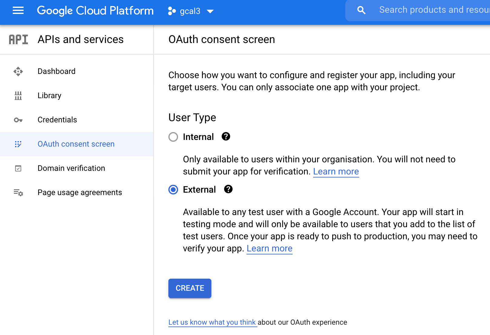
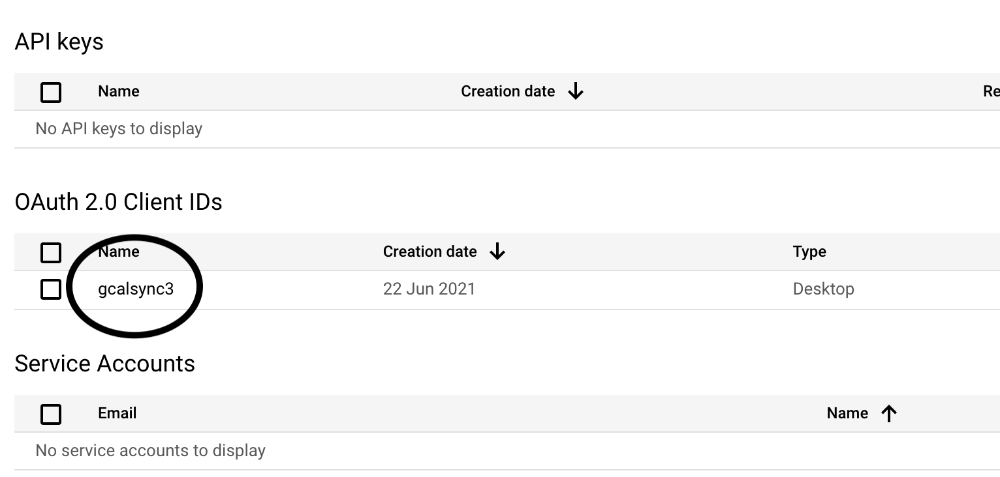

# Google Calendar Synchronisation

Pyhton script that synchronises calendars between two Google Accounts. 

Python 3 is required. 

## Security warnings

- This application copies data from one Google account calendar to a different one. Please, make share your that you are not sharing sensible data and confirm it with your organisation. 
- Make sure you don't expose any credential information (.json and .pickle files are ignored on `.gitignore` file to prevent this.

## How to install

```
pip3 install -r requirements.txt
```

## Run the application

To run the application, you have to generate as many `credential.json` files as Google Account you want to manage. To create those files, read the [credentials section](#credentials).

The first time the application is run, a pop-up appears to verify your credentials. If a message indicates that Google has not
verified the application, click on `Continue`.


Allow the permissions to edit calendars.


If you get a message like this, follow the instructions on it to enable calendar API.


### `gcallist` command

Let's suppose that we have already downloaded the credentials file to the root folder of this repository with a name `myaccount.credentials.json`. To list all the calendar ids and names from this account, run:

```shell script
python3 gcallist.py mmyacount
```

This will print something like:

```
ID: addressbook#contacts@group.v.calendar.google.com  NAME: Birthdays
ID: en.spain#holiday@group.v.calendar.google.com  NAME: Holidays in Spain
ID: XXX@gmail.com  NAME: XXX@thoughtworks.com
```

This is useful to know the ID of the source and target calendars in `gcalsync` commmand

### `gcalsync` command

This command copies event from a source calendar to a target one. Let's suppose we created two credentials files in the root folder:

```
account1.credentials.json
account2.credentials.json
```

The following command will copy all the events from one calendar (source) to another one (target)

```shell script
python3 gcalsync.py account1 "calendar-id-21" account2 "calendar-id-33" 1d
```

- `account1` is the source account. The name should match with any XXX.credentials.json file. 
- `calendar-id-21` is the id from the source calendar. To know this id, see [gcallist section](#gcallist-command).
- `account1` is the target account. The name should match with any XXX.credentials.json file. 
- `calendar-id-21` is the id from the target calendar. To know this id, see [gcallist section](#gcallist-command).
- `1d` means that it will copy events from current time to the end of this day. Other possible values
    - `2d`: will copy events from current timme to the end of tomorrow. 3d, 4d and so on are also possible. 
    - `1w`: will copy events from current time to the end of this week. 
    - `2w`: will copy events from current time to the end of next week. 3w, 4w and so on are also possible. 

`NOTE:` If you use "primary" as calendar id, you will use the account main calendar. Eg. this command would copy events from the main calendar in `account1` to the main calendar in `account2` 

```shell script
 python3 gcalsync.py myaccount primary myaccount primary 1d 
```

`NOTE:` You can also copy events from calendars inside the same account. Eg. this command would copy events from calendar with id c-1 to calendar with id c-2, both in the account `myaccount`

```shell script
 python3 gcalsync.py myaccount "c-1" myaccount "c-2" 2d 
````

`NOTE:` The command can safely be executed several times. All the already synchronised events will be removed from the target calendar and recreated. 

`NOTE:` By default, the name, description and location of the events are not copied to prevent exposing sensible data, but copying of sensible data can be enabled by adding the parameter `copySensibleData` at the end. Eg.

```shell script
python3 gcalsync.py account1 "calendar-id-21" account2 "calendar-id-33" 1d copySensibleData
```

## Credentials

1) Go to https://console.cloud.google.com/apis/credentials.
2) Set up a new project.


3) Choose any name (`gcal3` in the example) and don't select any organisation.


4) Select OAuth consent screen, select `External` as User Type and click on create. 



5) Set as app name to any name, eg. `gcalsync`. Only this name, user support email and developer contact information are mandatory.


6) Click on `Save and Continue`.

7) Then, in scopes, select `Add or remove scopes` and in `Manually add scopes` put this:

```
https://www.googleapis.com/auth/calendar
https://www.googleapis.com/auth/calendar.events
```

8) Click on `Add to table` and then in `Update`.

9) Click on `Save and Continue`

10) In test users, add your own user (Google email).

11) Click on `Save and Continue`.

12) Go to Credentials, `Create Credentials`, select `OAuth client ID`.


13) Set application type to `Desktop app` and choose any application name. 


14) Once created, click on the created credential.
 
 
 
15) Click on the credential and download json file to the gcalsync directory, with a name format like this:

```
name.credentials.json
```

where `name` can be chosen by you to identify your account. 


16) Repeat all the previous steps if you want to manage other accounts. 


# Possible improvements 

- Allow bi-directial synchronisation. Not very far away. 
- Publish a command to avoid cloning the repo. See [this link](https://towardsdatascience.com/how-to-build-and-publish-command-line-applications-with-python-96065049abc1).

